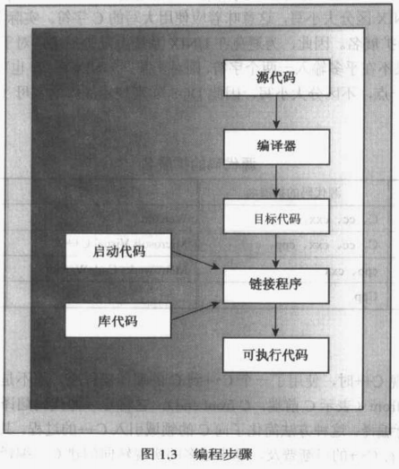
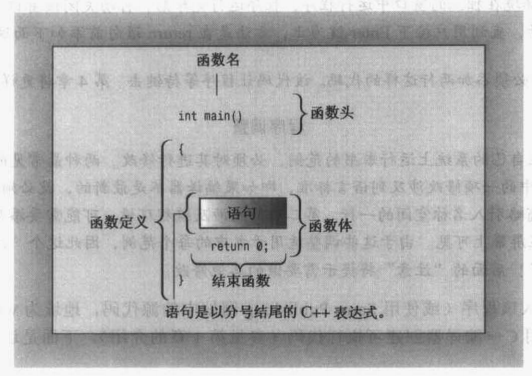
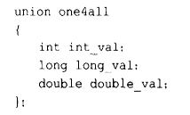

[TOC]

# C++ Primer Plus

## 1. 预备知识

- 在C++中，类是一种规范，它描述了新型的数据格式，对象是根据类构造的特点的数据结构。
- 类定义不仅定义了属性，还定义了对每个类可执行的操作，将数据和方法合并为类定义，有助于创建可重用的代码。
- 

## 2. 开始学习C++

- 

- #include <iostream> 

  - 该编译指令导致预处理器将 iostream 文件的内容添加到程序中。

  - iostream 中的 io 表示输入和输出，有了这定义，可以使用 cin 和 cout 进行输入和输出

- using namespace std;

  - 这是 using 编译指令( directive )，名称空间编译指令。

- endl

  - 控制符，endl 使得 打印字符串时，cout 自动移到下一行

- \n

  - 换行符，也是一种转义序列

## 3. 处理数据

- 整形

- short 、 int 、long

- 无符号类型：unsigned short、 unsigned int、 unsigned long

- char

- bool

- const 限定符

  - 浮点数 2.52e13, 8.3E-4

- 算术操作符，操作符的重载（使用相同符号进行多种操作）

- 类型转换

  - 赋值时进行的转换
  - 表达式中的转换

  - 传递参数的类型转换
  - 强制类型转换

## 4. 复合类型

- 数组 array 

- 字符串 string

- 面向行的输入：get()

- 结构体可以同时存储 int、long 和 double，共用体 union 只能存储 int、long 或 double

  

- 枚举 enum，可以代替 const，创建符号常量。

  ```
  enum bits{ one = 1, two = 2, four = 4, eight = 8};
  ```

- 指针和自由存储空间

  ```
  int* pt;
  pt = (int *) 0xB000000;
  // pt 是 int 值的地址
  ```

- new 分配内存

  ```
  int * pt = new int;
  *pt = 1001; //赋值
  ```

- delete 释放内存

- 动态数组

- 数组、结构和指针是C++的 3 种复合类型。

## 5. 循环和关系表达式

- for 循环，入口条件循环

- while 循环，入口条件循环

- do while 循环，出口条件循环

  ``` 
  do
  {
       cin >> n;
  } while( n != 7 );
  ```

- cin.get() 获得文本，EOF 结束输入

## 6. 分支语句和逻辑操作符

- if - else 语句
- switch 语句
- break 和 continue 语句
  - 当条件为 true 时，使用 break 结束循环
  - 当字符不为空格时，使用 continue 跳过计数部分
- 文本的 I/O 
  - 文本输入， # include <iostream>
  - 文本输出， # include <fstream>

## 7. 函数——C++的编程模块

- 函数原型
- 函数参数和按值传递
- 指针和 const
- 函数指针

## 8. 函数探幽

- C++内联函数，inline
- 引用变量 &
- 对象、继承和引用
- 函数重载（函数多态）

## 9. 内存模型和名称空间

- 单独编译

- 存储持续性、作用域和链接性

  - 说明符：auto、register、static、extern、mutable
  - 限定符：const、volatile 

- 布局（placement）new 操作符，new 负责在堆（heap）中找内存块

- 名称空间

  ```
  using Student::fetch;
  ```

## 10. 对象和类

- 过程性编程和面向对象编程

  - 面向对象编程：抽象、封装和数据隐藏、多态、继承、代码的可重用性

- 类概念

- 定义和实现类

- 公有类访问和私有类访问，public ，private

- 类的数据成员

- 类方法（类函数成员）

- 创建和使用类对象

- 类的构造函数和析构函数

  ``` 
  Buffoon::update();
  Buffoon::~update();
  ```

  

- const 成员函数

- this 指针

- 创建对象数组

- 类作用域

- 抽象数据类型

## 11. 使用类

- 操作符重载
- 友元函数
- 重载 << 操作符，以便于输出
- 状态成员
- 使用 rand() 生成随机值
- 类的自动转换和强制类型转换
- 类转换函数

## 12. 类和动态内存分配

- 对类成员使用动态内存分配
- 隐式和显式地复制构造函数
- 隐式和显式地重载复制操作符
- 在构造函数中使用 new 所必须完成的工作
- 使用静态类成员
- 将布局 new 操作符用于对象
- 使用指向对象的指针
- 实现队列抽象数据类型（ADT）

## 13. 类继承

- is-a 关系的继承
- 如何以公有的方式从一个类派生出另一个类
- 保护访问
- 构造函数成员初始化列表
- 向上和向下强制转换
- 虚拟成员函数
- 早期静态联编和晚期动态联编
- 抽象基类
- 纯虚函数
- 何时以及如何使用公有继承

## 14. C++中的代码重用

- has-a 关系
- 包含成员对象的类
- 模板类 valarray
- 私有和保护继承
- 多重继承
- 虚基类
- 创建类模板
- 使用类模板
- 模板的具体化

## 15. 友元、异常和其他

- 友元类
- 友元类方法
- 嵌套类
- 引发异常、try 块和 catch 块
- 异常类
- 运行阶段类型识别（RTTI）
- dynamic_cast 和 typeid
- static_cast、const_cast 和 reiterpret_cast

## 16. string 类和标准模板库

- 标准C++ string类
- auto_ptr 模板
- 标准模板库（STL）
- 容器类
- 迭代器
- 函数对象（functors）
- STL算法

## 17. 输入、输出和文件

- C++ 角度的输入和输出
- iostream 类系列
- 重定向
- ostream 类方法
- 格式化输出
- istream 类方法
- 流状态
- 文件 I/O
- 使用 ifstream 类从文件输入
- 使用 ofstream 类输出到文件
- 使用 fstream 类进行文件输入和输出
- 命令行处理
- 二进制文件
- 随机文件访问
- 内核格式化

